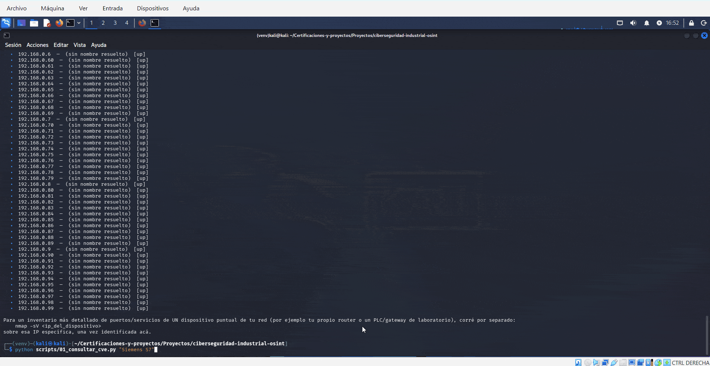

# Ciberseguridad Industrial — OSINT, CVEs y Mitigación

Proyecto de práctica del curso **Ciberseguridad Industrial** (Ingelearn),
que cubrió: consideraciones éticas y legales de la búsqueda de información,
OSINT aplicado a sistemas industriales, uso del sistema CVE, Shodan,
Kali Linux para análisis de redes, Google Dorks, y estrategias de
mitigación ante vulnerabilidades descubiertas.

Este proyecto se centra deliberadamente en el lado **defensivo**: consultar
información pública para proteger sistemas propios (los míos o los de un
cliente con autorización), no para buscar ni acceder a dispositivos de
terceros. Esa distinción es el primer módulo del curso y el eje de todo lo
demás.

## Demo



Los tres scripts corriendo en secuencia sobre mis propios activos: escaneo
de mi red local (`03`), y consulta de CVEs por producto (`01`).

## ⚠️ Marco ético y legal (leer antes de usar cualquier script)

- **OSINT y Shodan indexan información ya pública** — eso los hace legales
  de *consultar*. Lo que es ilegal es usar esa información para **acceder**
  a un sistema sin autorización, lo cual en Argentina cae bajo la
  **Ley 26.388 de Delitos Informáticos**, y en la mayoría de los países
  tiene marcos legales equivalentes.
- **Nunca escanees, consultes en profundidad ni intentes acceder** a redes
  o dispositivos que no sean tuyos, salvo que tengas autorización explícita
  y por escrito (por ejemplo, un contrato de pentesting con un cliente).
- Todos los scripts de este repo están **acotados por diseño** a tus
  propios activos: tu propia IP pública, tu propia red local, o bases de
  datos públicas de vulnerabilidades ya divulgadas. Ninguno busca ni lista
  dispositivos vulnerables de terceros.
- Si en el curso de un trabajo real encontrás una vulnerabilidad en un
  sistema que no es tuyo, la práctica correcta es la **divulgación
  responsable**: reportarla al dueño del sistema o a un CERT (en Argentina,
  [CERT.ar](https://www.argentina.gob.ar/jefatura/gabinete-de-ministros/innovacion-publica/ssti/cert)),
  nunca explotarla ni publicarla.

## Qué hace cada script (`scripts/`)

| Script | Qué hace |
|---|---|
| `01_consultar_cve.py` | Busca vulnerabilidades (CVE) ya publicadas en la NVD por palabra clave (ej. "Modbus", "Siemens S7", "SCADA"). Consulta pasiva a una base de datos pública — no accede a ningún sistema. |
| `02_verificar_exposicion_propia.py` | Consulta InternetDB (API gratuita de Shodan, sin cuenta ni API key) sobre **tu propia IP pública** (la obtiene automáticamente) para ver qué puertos/servicios tuyos son visibles desde internet, y si tienen CVEs conocidas asociadas. No acepta una IP arbitraria por diseño. |
| `03_escaneo_red_local.py` | Usa `nmap` para inventariar los dispositivos conectados en tu propia red local (por defecto un rango `192.168.x.x`, cambiar solo por otra red propia). Primer paso de cualquier auditoría: saber qué tenés conectado. |

## Cómo correrlo

```bash
git clone https://github.com/agustin-94/Certificaciones-y-proyectos.git
cd Certificaciones-y-proyectos/Proyectos/ciberseguridad-industrial-osint

pip install -r requirements.txt
sudo apt install nmap   # si no lo tenés (ya viene instalado en Kali Linux)

# Consultar CVEs de un producto/tecnología industrial
python scripts/01_consultar_cve.py "Modbus"
python scripts/01_consultar_cve.py "Siemens S7"

# Ver qué expone tu propia IP pública (gratis, sin cuenta ni API key)
python scripts/02_verificar_exposicion_propia.py

# Inventariar dispositivos en tu propia red local
python scripts/03_escaneo_red_local.py
```

## Metodología OSINT aplicada a sistemas industriales (resumen)

El flujo típico que sigue este proyecto, en orden:

1. **Reconocimiento pasivo**: qué tecnología/marca de PLC, gateway o
   software SCADA usa el sistema (información de fabricante, documentación
   pública, buscadores como Shodan sobre activos propios).
2. **Cruce con CVEs conocidas**: buscar si esa tecnología y versión tiene
   vulnerabilidades ya reportadas (script `01`).
3. **Inventario de exposición real**: verificar qué de eso está realmente
   expuesto — a internet (script `02`) y dentro de la red local
   (script `03`).
4. **Priorización y mitigación**: no todas las vulnerabilidades encontradas
   requieren acción inmediata; se priorizan por explotabilidad y criticidad
   del sistema afectado (ver checklist abajo).

Google Dorks (operadores de búsqueda avanzada de Google, como `site:`,
`filetype:`, `intitle:`) forma parte del mismo reconocimiento pasivo: sirven
para encontrar documentación técnica, manuales o paneles de administración
indexados públicamente. Se usan igual que Shodan — solo sobre activos
propios o con autorización, nunca para buscar accesos de terceros.

## Checklist de mitigación ante una vulnerabilidad encontrada

- [ ] **No exponer** a internet lo que no necesita estarlo (paneles de
      administración, PLCs, HMIs) — usar VPN para acceso remoto en su lugar.
- [ ] **Segmentar la red**: la red industrial (OT) separada de la red
      corporativa (IT), con firewall entre ambas.
- [ ] **Actualizar/parchear** el firmware o software afectado apenas el
      fabricante publique una corrección — priorizando por severidad (CVSS).
- [ ] **Cambiar credenciales por defecto** en cualquier dispositivo nuevo
      (una de las causas más comunes de exposición en Shodan).
- [ ] **Monitorear** con logs/alertas los accesos a sistemas críticos.
- [ ] Si no se puede parchear de inmediato (sistemas legacy comunes en
      planta), aplicar **mitigación compensatoria**: aislar el dispositivo,
      restringir por IP/firewall, o segmentar aún más esa parte de la red.
- [ ] Documentar y reportar el hallazgo internamente (o al dueño del
      sistema/CERT si es de un tercero), nunca dejarlo sin registrar.

## Qué demuestra este proyecto

- Comprensión del **marco ético y legal** de la ciberseguridad ofensiva y
  defensiva — no solo saber usar las herramientas, sino cuándo y cómo es
  legítimo hacerlo.
- Uso de **APIs públicas de seguridad** (NVD) para investigación de
  vulnerabilidades sin necesidad de herramientas comerciales.
- Uso de **Shodan** y **Kali Linux/nmap** de forma acotada y responsable,
  aplicada a activos propios.
- Una metodología clara de **OSINT → CVE → exposición real → mitigación**,
  aplicable a un entorno industrial (IT/OT), en línea con el resto del
  portafolio de automatización.

## Stack

`Python` · `Kali Linux` · `nmap` · `Shodan API` · `NVD API (CVE)`
