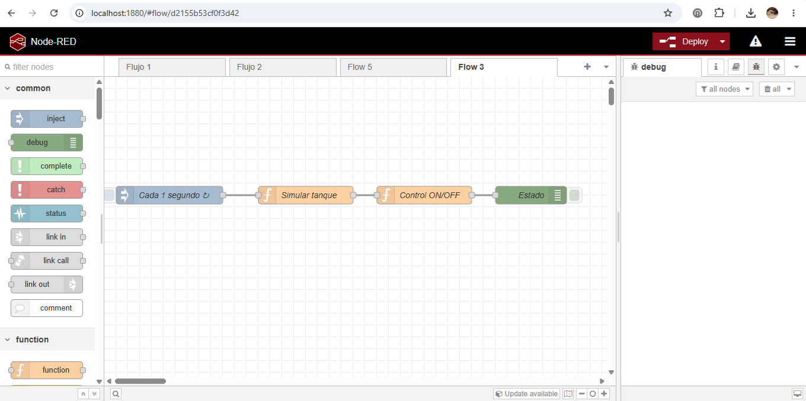

# Sistema de Control de Tanque – Node-RED

## Descripción
Simulación de un sistema industrial de control de nivel de tanque utilizando Node-RED. El flujo simula el llenado/vaciado del tanque y controla una bomba mediante lógica on/off basada en umbrales, replicando el comportamiento típico de un PLC.

## Diagrama del flujo
```
[Inject: cada 1s] → [Function: Simular tanque] → [Function: Control ON/OFF bomba] → [Debug: Estado]
```



## Funcionalidad
- Simulación de nivel de tanque (0–100%)
- Control automático de bomba (ON/OFF) según el nivel
- Lógica basada en umbrales (control tipo histéresis)
- Procesamiento continuo en tiempo real, disparado cada 1 segundo

## Lógica de control
| Condición       | Acción       |
|-----------------|--------------|
| Nivel < 30%      | Bomba ON     |
| Nivel > 80%      | Bomba OFF    |
| Entre 30% y 80%  | Se mantiene el estado anterior (histéresis) |

Este esquema de histéresis evita que la bomba esté prendiendo y apagando
constantemente cuando el nivel está cerca de un umbral — un problema común
en controles on/off simples.

## Tecnologías
- Node-RED
- JavaScript (function nodes)

## Conceptos aplicados
- Automatización industrial
- Lógica tipo PLC (control on/off con histéresis)
- Control de procesos en tiempo real

## Uso
1. Instalar [Node-RED](https://nodered.org/docs/getting-started/local).
2. Abrir el editor (por defecto en `http://localhost:1880`).
3. Menú ☰ → *Import* → pegar el contenido de `flow.json`.
4. Hacer clic en *Deploy* y abrir la pestaña *Debug* para ver el estado del
   tanque y la bomba actualizarse cada segundo.
