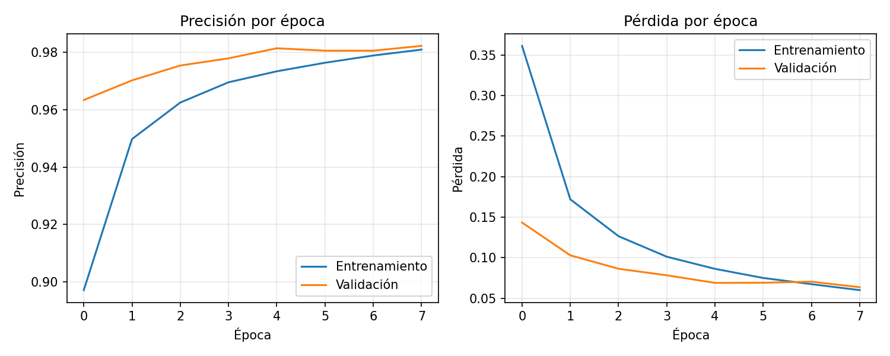
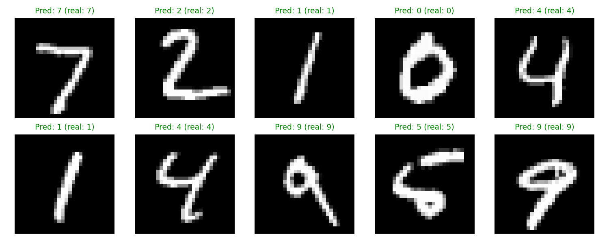

# Sistema OCR de Dígitos con Python + MQTT

## Descripción
Sistema de reconocimiento de dígitos manuscritos (OCR) con una red neuronal
entrenada en Keras/TensorFlow, integrado con MQTT para publicar cada
dígito reconocido como lo haría un lector automático de medidores en un
entorno industrial (IT/OT).

## Aplicación
Simulación de lectura automática de datos en entornos industriales:
- Lectura de medidores analógicos digitalizados
- Identificación de códigos numéricos
- Digitalización de información hacia un dashboard (vía MQTT)

## Arquitectura
```
train.py           → entrena el modelo con MNIST y guarda modelo_ocr.h5
predictor_mqtt.py  → carga el modelo (o simula) y publica predicciones por MQTT
```

## Tecnologías
- Python
- TensorFlow / Keras
- paho-mqtt
- NumPy / Matplotlib

## Funcionalidad
- Entrenamiento de una red neuronal sobre el dataset MNIST (dígitos 0-9)
- Evaluación y visualización de precisión/pérdida por época
- Predicción de dígitos y publicación del resultado por MQTT (topic `ocr/digito`)
- Modo simulación (sin modelo ni broker) para probar la integración de mensajería
  de forma aislada

## Resultados
Precisión real obtenida: **97.97%** en el set de test de MNIST tras 8
épocas de entrenamiento con una red densa simple (128 neuronas + dropout).



## Conceptos aplicados
- Machine Learning / redes neuronales
- Procesamiento de imágenes
- Mensajería IoT (MQTT) para integrar visión artificial con un dashboard

## Integración con Node-RED (dashboard en tiempo real)
Este proyecto se conecta con [`node-red-tanque`](../node-red-tanque) por el
mismo protocolo (MQTT), demostrando cómo un mismo broker puede integrar
distintos sistemas: acá, Node-RED se suscribe al topic `ocr/digito` y
muestra un dashboard con el último dígito reconocido y su historial.

**Setup:**
1. Instalar y correr [Mosquitto](https://mosquitto.org/download/) (o
   cualquier broker MQTT) en `localhost:1883`.
2. En Node-RED, instalar el paleta de dashboard:
   `Menú ☰ → Manage palette → Install → node-red-dashboard`.
3. Importar `dashboard_flow.json` (`Menú ☰ → Import`) y hacer *Deploy*.
4. Correr `python predictor_mqtt.py` — los dígitos van a empezar a
   aparecer en el dashboard de Node-RED en `http://localhost:1880/ui`.

> 📸 *Pendiente: agregar captura del dashboard funcionando
> (`assets/dashboard_nodered.png`).*

## Uso

**1. Entrenar el modelo:**
```bash
pip install -r requirements.txt
python train.py
```
Esto genera `modelo_ocr.h5` y dos gráficos en `assets/`: la curva de
entrenamiento y ejemplos de predicción sobre dígitos de test.

**2. Publicar predicciones por MQTT:**
```bash
python predictor_mqtt.py
```
Por defecto corre en modo simulación (dígitos aleatorios, no requiere
modelo entrenado ni broker corriendo — si no hay broker disponible, igual
imprime las "publicaciones" en consola). Para modo real con el modelo
entrenado y un broker MQTT activo, ver los comentarios en el bloque
`if __name__ == "__main__":` del script.

## Nota sobre esta versión
El código original de este proyecto se había perdido (solo quedaba el
README). Esta versión reconstruye el pipeline completo: entrenamiento del
modelo con MNIST + integración MQTT basada en el script de predicción
original.
