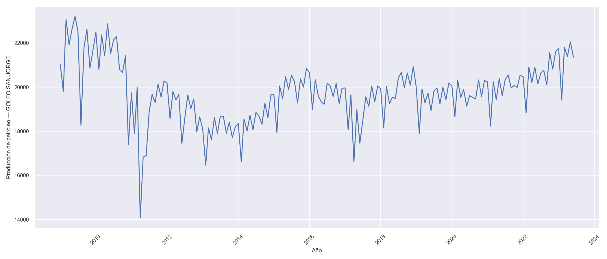
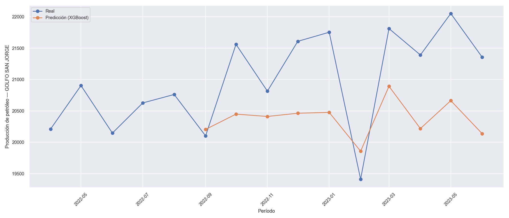

# Pronóstico de Producción de Petróleo (XGBoost)

## Descripción
Análisis y pronóstico de la producción mensual de petróleo en la cuenca
**Golfo San Jorge** (Argentina) usando un modelo de regresión con
**XGBoost**. El proyecto parte de un dataset público de producción de
hidrocarburos, agrega la serie temporal por cuenca, y entrena un modelo
para predecir los últimos períodos, comparándolos contra los valores
reales.

## Fuente de datos
El dataset (`PetroleoArg.csv`) se basa en los reportes públicos de
producción de petróleo y gas de la **Secretaría de Energía de la Nación**,
disponibles en [datos.gob.ar](https://datos.gob.ar/dataset?tags=Petr%C3%B3leo).
Columnas utilizadas: `empresa`, `anio`, `mes`, `provincia`, `cantidad`,
`indice_tiempo`, `areayacimiento`, `concepto`, `cuenca`.

> El archivo CSV no se incluye en este repositorio por tamaño/licencia —
> descargalo del portal oficial y colocalo en la raíz de esta carpeta como
> `PetroleoArg.csv` antes de correr el script.

## Pipeline
1. **Carga y filtrado**: se queda solo con las columnas relevantes y filtra
   la cuenca Golfo San Jorge.
2. **Agregación temporal**: agrupa por `indice_tiempo` (año-mes) y promedia
   los valores numéricos.
3. **Split**: separa los últimos 10 períodos como validación "real" (fuera
   del entrenamiento) y el resto para entrenar/testear.
4. **Entrenamiento**: `XGBRegressor` con early stopping.
5. **Evaluación**: compara la predicción de esos últimos 10 períodos contra
   los valores reales y grafica ambas series.

## Resultados



*(Gráficos generados con datos de prueba para validar que el pipeline
corre de punta a punta — se regeneran automáticamente con el dataset real
al ejecutar el script.)*

## Tecnologías
- Python
- Pandas / NumPy
- Seaborn / Matplotlib
- scikit-learn (`train_test_split`)
- XGBoost

## Uso
```bash
pip install -r requirements.txt
python petroleo_forecast.py
```

## Bugs corregidos respecto al código original
Durante el curso surgieron un par de cambios de comportamiento por
versiones nuevas de las librerías, ya corregidos en este script:

- **`numeric_only=True` en `.groupby().mean()`**: versiones recientes de
  Pandas intentan promediar también columnas de texto si no se los pide
  explícitamente, lo que rompía con `TypeError`.
- **`eval_metric` y `early_stopping_rounds` en el constructor**: en
  XGBoost ≥ 2.0 estos parámetros se definen al crear el modelo
  (`xgb.XGBRegressor(...)`), no en `.fit()`.

## Nota sobre el modelo: límites de extrapolación
Al probar el pipeline completo se encontró algo importante: como
`año` y `mes` son las únicas variables predictoras y XGBoost es un modelo
**basado en árboles**, no puede extrapolar más allá del rango de años que
vio durante el entrenamiento. Si los últimos períodos de validación caen
en un año nuevo (no visto en el train), la predicción tiende a "aplanarse"
en el valor del último nodo del árbol, en vez de seguir una tendencia.

Esto es una limitación conocida de los modelos de árboles (a diferencia,
por ejemplo, de una regresión lineal, que sí puede proyectar una
tendencia hacia adelante). Una mejora posible para este proyecto sería
agregar *features* que capturen la tendencia de forma explícita (por
ejemplo, un índice numérico incremental de tiempo, o lags de la propia
serie) en lugar de depender solo de año/mes como categorías.

## Conceptos aplicados
- Series de tiempo / forecasting
- Feature engineering básico (agregación temporal)
- Gradient boosting (XGBoost) y early stopping
- Evaluación de modelos y limitaciones de extrapolación en modelos de árboles
