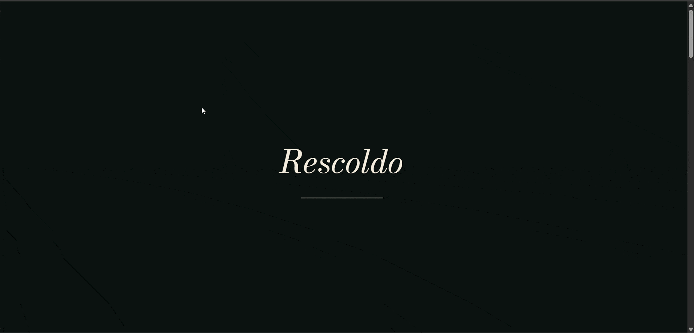

# Rescoldo — Demo de sitio web a medida (con animaciones 3D)

Proyecto demostrativo pensado para **ofrecer desarrollo de sitios web a
medida**: un restaurante de cocina de fuego patagónica (ficticio), con
scroll animations (GSAP + ScrollTrigger) y piezas 3D generadas con
Three.js para representar cada plato insignia sin depender de fotografías
de stock.

No es una plantilla ni un tema genérico — está construido desde cero para
mostrar el tipo de sitio que puedo desarrollar para un cliente real, con
diseño, animación y estructura de contenido pensados a medida del rubro.

**Stack:** HTML · CSS · JavaScript · GSAP · ScrollTrigger · Three.js

## Demo



## Qué ofrezco con este tipo de proyecto

Este sitio es una muestra de lo que puedo construir para cualquier
negocio que necesite presencia web: restaurantes, comercios, profesionales
independientes, etc. El servicio incluye:

- **Diseño y desarrollo a medida** del sitio (no plantillas prearmadas),
  adaptado al rubro y la identidad del cliente.
- **Animaciones e interactividad** (scroll animations, elementos 3D,
  transiciones) cuando el proyecto lo justifica, sin sacrificar velocidad
  de carga.
- **Actualización de contenido a cargo mío**: el cliente no necesita tocar
  código ni archivos — cualquier cambio de carta, precios, horarios,
  fotos o textos se lo pido y lo actualizo yo, para evitar que se rompa
  el sitio por una edición manual mal hecha.
- **Hosting y despliegue**: subida a Hostinger (o el hosting que use el
  cliente) y mantenimiento básico incluido.
- **Responsive** y optimizado para que funcione bien en celular, que es
  desde donde la mayoría de los clientes finales va a entrar.

## Cómo está construido (ficha técnica)

- Todo el contenido editable (nombre del negocio, carta/catálogo,
  horarios, contacto, redes) vive separado en un único archivo de datos
  (`lib/manifest.js`), lo que permite reutilizar la misma base de diseño
  para distintos clientes cambiando solo esos datos, sin tocar el resto
  del código.
- Las piezas 3D de los platos (`lib/dishes-3d.js`) se generan por código
  con Three.js — no son modelos descargados ni fotos, así que no hay
  costos de licencia ni dependencia de un banco de imágenes.
- Animaciones de scroll con GSAP + ScrollTrigger, pensadas para que se
  sientan premium sin afectar el rendimiento en celulares de gama media.
- Configuración de cache (`.htaccess`) para que los cambios se vean
  reflejados rápido después de cada actualización.

## Estructura de archivos

```
index.html          → la página
styles.css           → estilos (colores, tipografías, tamaños)
main.js              → interacción (menú, animaciones, formulario)
lib/manifest.js      → datos del negocio (nombre, catálogo, horarios, contacto)
lib/dishes-3d.js     → piezas 3D generadas por código con Three.js
lib/gsap.min.js, lib/ScrollTrigger.min.js, lib/three.min.js → librerías
.htaccess            → control de cache para despliegues
```

## Adaptar este mismo proyecto a otro rubro

La base de este sitio (estructura de secciones, animaciones, piezas 3D) es
reutilizable para otros negocios más allá de un restaurante — cambiando el
`manifest.js` y los textos/colores de marca, el mismo esqueleto sirve para
un comercio, un profesional independiente o un evento. Es, en los hechos,
la base sobre la que ofrezco un sitio a medida a un cliente nuevo.
