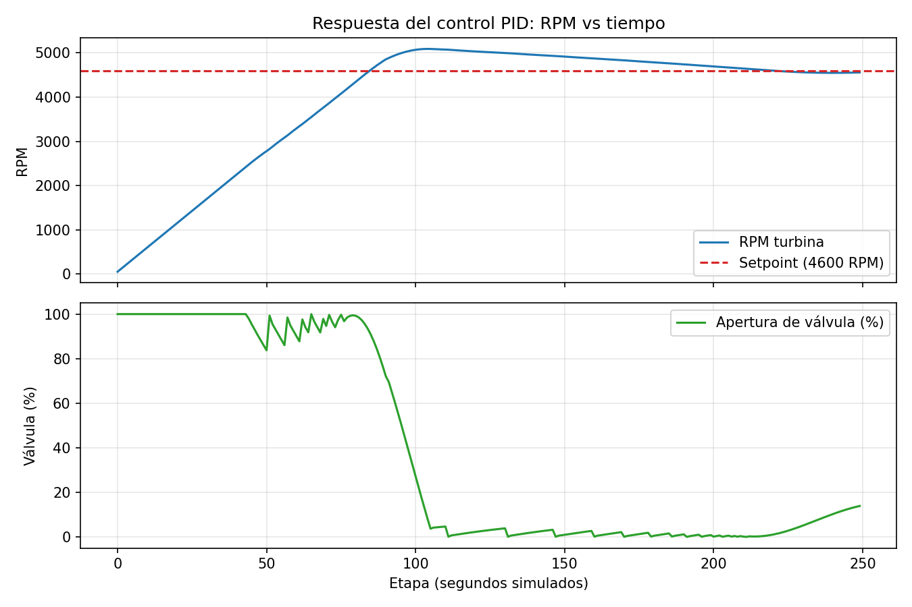

# Simulación de Turbina con Control PID

## Descripción
Simulación en Python de una turbina industrial con control automático de velocidad (RPM) mediante un algoritmo PID. El controlador ajusta la apertura de una válvula para llevar y mantener las RPM en el setpoint objetivo (4600 RPM), incluso frente a perturbaciones como fricción y componentes on/off (motor auxiliar, quemadores).

## Resultado


El sistema parte de 0 RPM, tiene un overshoot controlado por encima del setpoint y se estabiliza cerca de las 4600 RPM objetivo.

## Tecnologías
- Python
- Matplotlib (visualización de resultados)
- Control PID con anti-windup

## Funcionalidad
- Control dinámico de RPM mediante PID
- Ajuste automático de apertura de válvula (0-100%)
- Simulación de motor auxiliar y quemadores (Q1, Q2)
- Anti-windup: evita que la integral del PID se "dispare" cuando la salida
  está saturada, lo que en la primera versión hacía que el sistema no
  convergiera al setpoint

## Conceptos aplicados
- Automatización industrial
- Control PID (proporcional-integral-derivativo)
- Anti-windup / manejo de saturación de actuadores
- Sistemas dinámicos con proceso tipo integrador

## Ejecución
```bash
pip install matplotlib
python turbina.py
```

Al ejecutarlo se imprime el estado etapa a etapa en consola y se genera
`assets/grafico_rpm.png` con la evolución de RPM y apertura de válvula.

## Notas de diseño
El proceso que se simula acá se comporta como un integrador: la válvula no
fija el RPM directamente, sino que fija su *tasa de cambio*. Aplicar un PID
"de libro" a este tipo de proceso sin anti-windup tiende a generar
oscilaciones o divergencia — algo que se corrigió ajustando las ganancias
(`kp=0.05, ki=0.01, kd=0.15`) y agregando la lógica de anti-windup descrita
arriba.
