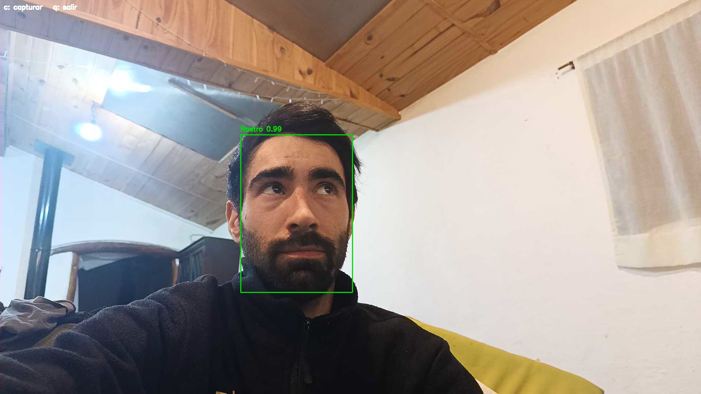
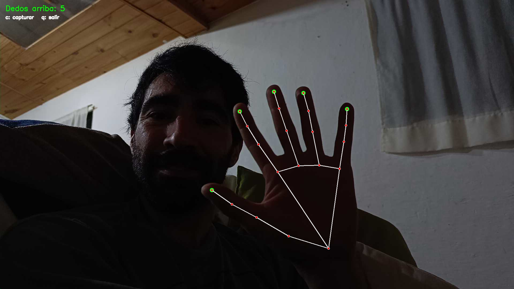
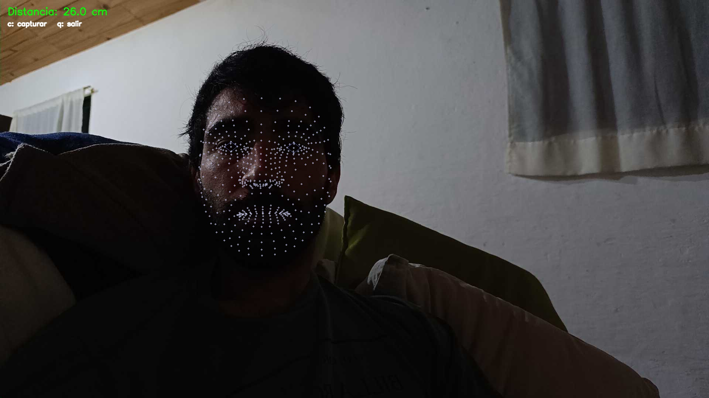
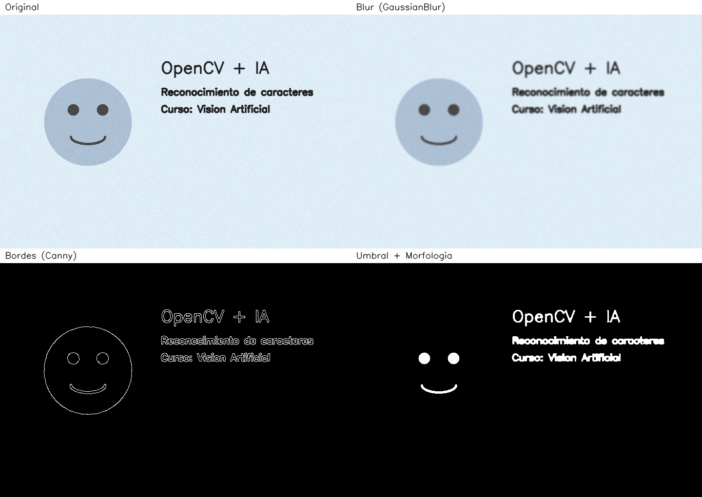

# Visión Artificial con OpenCV — Filtros, Rostros, Manos, Iris y OCR

Proyecto de práctica del curso **OpenCV y Reconocimiento de Imágenes con
IA**, que cubrió un temario extenso: carga y manipulación de imágenes,
anotaciones, mejora de calidad, manejo de video y streaming, filtros
avanzados, extracción de características, alineación de imágenes, HDR,
tracking de objetos, OCR (imagen y video), detección de rostros (Haar
Cascade, DNN y MediaPipe), detección de manos, detección de objetos (SSD),
estimación de pose y distancia de iris.

Todas las capturas de este README son reales, corridas en vivo desde mi
propia cámara (el celular usado como webcam vía la app IP Webcam, ver
sección más abajo) — no son imágenes de stock ni de ejemplo del curso.

## Detección de rostro (modelo DNN)

`src/05_captura_rostro_dnn.py` — detección facial en vivo con un modelo de
red neuronal (SSD sobre Caffe), mucho más robusto que Haar Cascade ante
variaciones de ángulo e iluminación:



## Detección de manos y conteo de dedos

`src/06_deteccion_manos.py` — MediaPipe Hands dibuja los 21 puntos de la
mano y cuenta cuántos dedos están levantados comparando la distancia de
cada punta a la palma contra la de su nudillo medio:



## Distancia a la cámara por iris

`src/07_distancia_iris.py` — MediaPipe Face Mesh mide el diámetro del iris
en píxeles y, sabiendo que el iris humano mide ~11.7mm siempre, despeja la
distancia real a la cámara con el modelo de cámara pinhole:



## Filtros clásicos de procesamiento de imagen

`src/02_filtros.py` — blur, detección de bordes (Canny), umbral y
operación morfológica, sobre una imagen de muestra generada por código:



## OCR (reconocimiento de caracteres)

`src/04_ocr_caracteres.py` — preprocesamiento (escala de grises + umbral
de Otsu) y reconocimiento con Tesseract sobre la misma imagen de muestra:

```
Texto detectado:
----------------------------------------
OpenCV + IA
Reconocimiento de caracteres
Curso: Vision Artificial
----------------------------------------
```

## Qué hace cada script (`src/`)

| Script | Qué muestra |
|---|---|
| `00_generar_imagen_muestra.py` | Genera una imagen sintética de referencia para probar el pipeline sin cámara. |
| `01_imagenes_basico.py` | Carga de imagen, conversión de espacio de color, resize y recorte (ROI). |
| `02_filtros.py` | Blur, bordes (Canny), umbral y morfología. Genera el collage de arriba. |
| `03_deteccion_rostros.py` | Detección facial con Haar Cascade (clasificador clásico). No detecta nada sobre la imagen sintética — esperable, ver nota abajo. |
| `04_ocr_caracteres.py` | Preprocesamiento + reconocimiento de texto con Tesseract. |
| `05_captura_rostro_dnn.py` | Detección facial en vivo con modelo DNN + captura de fotos propias (imagen de arriba). |
| `06_deteccion_manos.py` | Detección de manos en vivo con MediaPipe + conteo de dedos (imagen de arriba). |
| `07_distancia_iris.py` | Estimación de distancia a la cámara por iris con MediaPipe Face Mesh (imagen de arriba). |

Los scripts `05`, `06` y `07` usan cámara en vivo (webcam o celular) y
comparten los mismos controles: `c` captura una foto en `capturas/`, `q`
sale.

## Detección de rostros: Haar vs. DNN

`03_deteccion_rostros.py` usa Haar Cascade sobre una imagen sintética de
prueba y no detecta nada — es esperable: Haar está entrenado sobre rasgos
de caras reales, no formas geométricas. El modelo DNN de `05` sí detecta
caras reales de forma robusta, como se ve en la captura de arriba.

## Usar el celular como webcam

Como no tengo webcam en la PC, para los scripts en vivo (`05`, `06`, `07`)
uso el celular como cámara IP:

1. Instalar la app **IP Webcam** (Android, gratuita) desde Play Store.
2. Abrirla, bajar hasta el final y tocar **Iniciar servidor**. Muestra una
   URL tipo `http://192.168.0.XX:8080`.
3. Celular y PC en la **misma red WiFi**.
4. **Importante:** desactivar el bloqueo automático de pantalla del
   celular (Ajustes → Pantalla → Tiempo de espera) o dejar la app en
   primer plano — si la pantalla se bloquea, la cámara deja de transmitir
   y Python no puede conectarse.
5. En el script que quieras correr, cambiar `FUENTE = 0` por:
   ```python
   FUENTE = "http://192.168.0.XX:8080/video"
   ```
6. Correr el script. `c` para capturar, `q` para salir.

Si tenés webcam en la PC, dejá `FUENTE = 0` (o probá `1`, `2`).

## ⚠️ Nota de compatibilidad de versiones

Este proyecto fija versiones exactas en `requirements.txt` porque tanto
OpenCV como MediaPipe tuvieron cambios grandes de API en versiones
recientes que rompen este código:

- **OpenCV 5.0** eliminó `cv2.dnn.readNetFromCaffe()` (usado en `05`). Se
  fija `opencv-python==4.10.0.84`.
- **MediaPipe ≥ 0.10.2x** dejó de exponer la API clásica `mp.solutions`
  (Hands, FaceMesh) en favor de la nueva API "Tasks". Los scripts `06` y
  `07` usan la API clásica, así que se fija `mediapipe==0.10.14`.

**Instalá siempre con `pip install -r requirements.txt`**, no con
`pip install opencv-python` / `pip install mediapipe` sueltos.

## Mis propias capturas

Las imágenes de este README (`ejemplos/capturas_propias/`) son capturas
reales mías, elegidas y subidas a propósito para mostrar el proyecto
funcionando. Las capturas nuevas que vayas sacando con `c` se guardan en
`capturas/`, que **no se sube al repo por privacidad** (ver `.gitignore`)


## Cómo correrlo

```bash
git clone https://github.com/agustin-94/Certificaciones-y-proyectos.git
cd Certificaciones-y-proyectos/vision-artificial-opencv

pip install -r requirements.txt

# Tesseract (motor de OCR) debe estar instalado en el sistema:
#   Ubuntu/Debian: sudo apt-get install tesseract-ocr tesseract-ocr-spa
#   Windows: instalador de UB-Mannheim (agregar tesseract.exe al PATH)

python src/00_generar_imagen_muestra.py
python src/01_imagenes_basico.py
python src/02_filtros.py
python src/03_deteccion_rostros.py
python src/04_ocr_caracteres.py

# Con webcam o celular como cámara IP (ver sección de arriba):
python src/05_captura_rostro_dnn.py
python src/06_deteccion_manos.py
python src/07_distancia_iris.py
```

## Qué demuestra este proyecto

- Manejo de **OpenCV** para imágenes y video: filtros clásicos, Haar
  Cascade, y consumo de video en vivo desde una fuente no convencional
  (celular como cámara IP).
- **Detección facial** con dos enfoques (Haar vs. DNN), aplicada en vivo
  sobre mi propia cara.
- **MediaPipe** para tracking de landmarks: manos (conteo de dedos por
  geometría de distancias) y malla facial con iris (estimación de
  distancia real por cámara pinhole).
- **OCR** combinando preprocesamiento con OpenCV y Tesseract.
- Manejo consciente de **compatibilidad de dependencias**: fijar versiones
  cuando una librería cambia de API entre releases (pasó con OpenCV 5.0 y
  con MediaPipe en este mismo proyecto, y quedó documentado y resuelto).

## Créditos del modelo DNN

`modelos/dnn-caras/` contiene el detector facial SSD (ResNet10 + Caffe) de
la [librería de modelos oficial de OpenCV](https://github.com/opencv/opencv/tree/master/samples/dnn),
usado ampliamente en tutoriales y proyectos educativos de visión artificial.

## Stack

`Python` · `OpenCV` (módulo `dnn`) · `MediaPipe` (Hands, Face Mesh) · `NumPy` · `Tesseract OCR` (via `pytesseract`)
